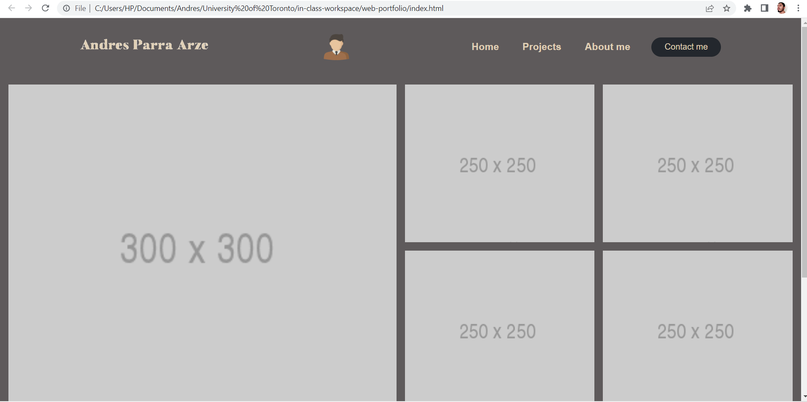

# web-portfolio

## Description

This was done in order to show my portfolio and be able to connect with more people and show them my work while also providing them my contact information through social
media so that they can see more about me.

## Installation

Just run the html code provided or use the link of the page in order to run and see the end result - https://andresparraarze.github.io/web-portfolio/

## Usage

    ```md
    
    ```

## License

           GNU AFFERO GENERAL PUBLIC LICENSE
              Version 3, 19 November 2007

 Copyright (C) 2007 Free Software Foundation, Inc. <https://fsf.org/>
 Everyone is permitted to copy and distribute verbatim copies
 of this license document, but changing it is not allowed.
